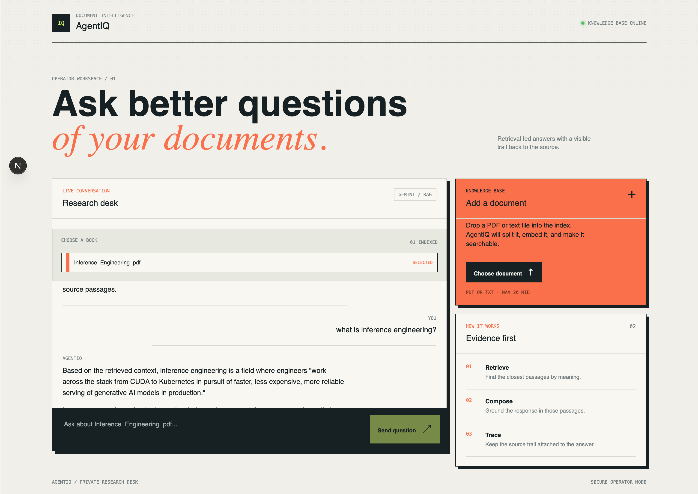

# AgentIQ

AgentIQ is a Python retrieval-augmented generation (RAG) foundation for
searching text and PDF documents with Google Gemini embeddings and Firebase
Firestore vector search.

The repository currently provides three operator-facing workflows:

- ingest a document, create chunks, generate embeddings, and store them in
  Firestore;
- query the indexed collection through a terminal chat loop;
- use a Next.js web workspace to select an indexed collection, ask questions,
  view Markdown-formatted answers with sources, and upload documents.



> **Project status:** early-stage foundation. It is suitable for local
> development and controlled evaluation. It is not yet a hardened public
> service: authentication, authorization, job orchestration, observability,
> and automated tests still need to be added before internet-facing use.

## Contents

- [Architecture](#architecture)
- [Requirements](#requirements)
- [Installation](#installation)
- [Configuration](#configuration)
- [Usage](#usage)
- [Data and security](#data-and-security)
- [Development](#development)
- [Known limitations](#known-limitations)
- [Project layout](#project-layout)
- [Contributing](#contributing)
- [License](#license)

## Architecture

```text
                         +------------------+
                         |  Text or PDF     |
                         +--------+---------+
                                  |
                                  v
                         +------------------+
                         | Extract and      |
                         | split into chunks|
                         +--------+---------+
                                  |
                    +-------------+-------------+
                    |                           |
                    v                           v
          +-------------------+        +------------------+
          | Firestore chunk   |        | Gemini embedding |
          | metadata          |        | batch job        |
          +---------+---------+        +--------+---------+
                    |                           |
                    +-------------+-------------+
                                  v
                         +------------------+
                         | Firestore vector|
                         | search           |
                         +--------+---------+
                                  |
                                  v
                         +------------------+
                         | Gemini response  |
                         +------------------+
```

The ingestion pipeline uses token-aware recursive chunking. It stores chunk
metadata first, creates a Gemini batch embedding job, and then updates the
Firestore documents with vectors and token counts. The chat workflow embeds a
query, retrieves the nearest vectors, and supplies their text to Gemini as
context.

## Requirements

- Python 3.11 or newer
- A Firebase project with Firestore enabled
- A Firestore vector index for the configured embedding field
- A Google Gemini API key and access to the configured models
- [`uv`](https://docs.astral.sh/uv/) or another Python package installer
- Node.js 20.9 or newer and npm

## Installation

Clone the repository and install the locked dependencies:

```bash
uv sync
```

Alternatively, install the package with pip:

```bash
python -m pip install .
```

Install development dependencies with:

```bash
uv sync --group dev
```

The Next.js frontend lives in `web/`. Install its dependencies with:

```bash
cd web
npm install
```

## Configuration

Copy the example file and replace its placeholders:

```bash
cp .env.example .env
```

The application loads `.env` for local development. In production, inject
these values through the deployment environment or a secret manager.

| Variable | Required | Default | Description |
| --- | --- | --- | --- |
| `GEMINI_API_KEY` | Yes | None | Gemini API credential. |
| `API_ACCESS_TOKEN` | Yes for API endpoints | None | Bearer token required by `/query` and `/ingest`. |
| `FIRESTORE_COLLECTION_NAME` | Yes | None | Collection queried by the chat workflow. |
| `FIREBASE_SERVICE_ACCOUNT_BASE64` | No | Application Default Credentials | Base64-encoded Firebase service-account JSON. |
| `LANGUAGE_MODEL` | No | `gemini-3.5-flash` | Gemini generation model. |
| `EMBEDDING_MODEL` | No | `gemini-embedding-2` | Gemini embedding model. |
| `EMBEDDING_CHUNK_SIZE` | No | `700` | Target chunk length in estimated tokens. |
| `EMBEDDING_OVERLAP_SIZE` | No | `140` | Overlap between adjacent chunks. Must be smaller than chunk size. |
| `OUTPUT_DIMENSIONALITY` | No | `512` | Embedding vector dimension. Must match the Firestore vector index. |
| `JSON_REQUESTS_FILE_NAME` | No | `chunks.jsonl` | Local JSONL file used for the embedding batch request. |

Configuration is validated at startup. Numeric values must be positive, and
the overlap must be smaller than the chunk size.

### Firebase credentials

For local development or Vercel, encode the service-account JSON and store the
result in `FIREBASE_SERVICE_ACCOUNT_BASE64` as a server-side secret:

```bash
base64 -i agent_iq_firebase_admin_private_key.json | tr -d '\\n'
```

For deployed workloads, prefer Application Default Credentials when available.
Never commit `.env`, service-account JSON files, Base64 credentials, or API
keys. The application decodes the Base64 value in memory and does not create a
credential file.

## Usage

### Ingest a document

Run the ingestion command from the repository root:

```bash
uv run python -m agent_iq.embeddings.ingest
```

When prompted, provide a path to a `.txt` or `.pdf` file. The pipeline will:

1. extract the document text;
2. split it into overlapping chunks;
3. write chunk metadata to a Firestore collection derived from the filename;
4. upload a JSONL embedding request to Gemini;
5. create and poll a Gemini batch embedding job;
6. attach the returned vectors and token counts to the Firestore documents.

### Start the terminal chat workflow

Set `FIRESTORE_COLLECTION_NAME` to the collection you want to query, then run:

```bash
uv run python main.py
```

Type `exit` to end the session.

### Run the API

Start the FastAPI application with Uvicorn:

```bash
uv run uvicorn agent_iq.api:app --host 0.0.0.0 --port 8000
```

The API provides:

| Method | Endpoint | Purpose | Authentication |
| --- | --- | --- | --- |
| `GET` | `/health` | Liveness check. | None |
| `GET` | `/collections` | List Firestore collections available for chat. | Bearer token |
| `POST` | `/query` | Retrieve context and generate an answer for a selected collection. | Bearer token |
| `POST` | `/ingest` | Ingest one `.txt` or `.pdf` document. | Bearer token |

Example query:

```bash
curl -X POST http://localhost:8000/query \
  -H "Authorization: Bearer $API_ACCESS_TOKEN" \
  -H "Content-Type: application/json" \
  -d '{"query":"What is this document about?","collection_name":"Inference_Engineering_pdf"}'
```

Example ingestion:

```bash
curl -X POST http://localhost:8000/ingest \
  -H "Authorization: Bearer $API_ACCESS_TOKEN" \
  -F "file=@document.pdf"
```

The current `/ingest` endpoint waits for the complete embedding batch job.
For production workloads, move ingestion to a durable background job queue and
return a job ID instead of holding the HTTP request open.

### Run the web frontend

Create `web/.env.local` from the example and set the FastAPI URL and shared
operator token:

```bash
cp web/.env.local.example web/.env.local
```

Start the frontend in a second terminal:

```bash
cd web
npm run dev
```

Open <http://localhost:3000>. The browser communicates with Next.js through
`/api/collections`, `/api/query`, and `/api/ingest`; the FastAPI bearer token
remains server-side. Select a collection before sending a question. Assistant
answers support Markdown formatting, including headings, lists, tables, links,
and code blocks.

## Data and security

Document text is sent to Google Gemini for embedding and response generation.
Confirm that this processing complies with your organization's privacy,
retention, residency, and regulatory requirements.

Before any production deployment:

- rotate credentials that may have been exposed during development;
- use a secret manager and least-privilege Firebase permissions;
- configure Gemini and Firebase quotas, budgets, and monitoring;
- add authentication, authorization, tenant isolation, and rate limiting for
  any network-facing interface;
- bound query size, retrieved context, conversation history, and model spend;
- add secret scanning and dependency vulnerability scanning to CI.

To report a security issue, do not open a public issue containing credentials
or sensitive document content. Contact the repository maintainers through the
private security channel established for your organization.

## Development

Run the available static checks:

```bash
uv run ruff check agent_iq main.py
uv run python -m compileall -q agent_iq main.py
```

Run the frontend checks from `web/`:

```bash
cd web
npm run lint
npm run build -- --webpack
```

Before submitting changes, also verify that:

- no secrets or generated JSONL files are tracked;
- document extraction works for representative text and PDF files;
- the Firestore vector index dimension matches `OUTPUT_DIMENSIONALITY`;
- failures from Gemini and Firestore do not leave unrecoverable partial data;
- changes are tested in an isolated project or with deterministic mocks.

## Known limitations

- The terminal chat and Next.js web workspace are the available interfaces.
- The web workspace currently uses one shared bearer token; there is no user
  identity or multi-tenant authorization.
- API ingestion is synchronous and has no durable job queue.
- Ingestion writes metadata before embedding completion; failed jobs may leave
  documents without vectors.
- Ingestion uses shared local JSONL filenames, so concurrent runs can conflict.
- Batch polling has no configured timeout or cancellation workflow.
- Embedding result parsing assumes every returned row is valid.
- Retrieved context and conversation history are not yet bounded by a token
  budget.
- There is no automated test suite or CI pipeline in the repository.

## Project layout

```text
agent_iq/
├── config.py                    # Environment loading and validation
├── connections/
│   ├── firebase.py              # Firebase initialization
│   └── genai.py                 # Gemini client initialization
└── embeddings/
    ├── chunking.py              # Text and PDF extraction
    ├── embed.py                 # Embeddings and vector retrieval
    ├── ingest.py                # Ingestion orchestration
    └── splitter.py              # Token-aware chunking
  api.py                          # FastAPI service endpoints
main.py                          # Terminal RAG chat workflow
  web/
  ├── src/app/page.tsx             # Next.js operator workspace
  └── src/app/api/                 # Server-side FastAPI proxy routes
pyproject.toml                   # Package metadata and dependencies
uv.lock                          # Locked dependency resolution
```

## Contributing

1. Create a focused branch for your change.
2. Keep credentials, private documents, and generated files out of Git.
3. Run Ruff and compilation checks locally.
4. Add or update tests for behavior changes.
5. Describe configuration, migration, and security implications in the pull
   request.

## License

No license has been specified yet. Treat the repository as all-rights-
reserved until the maintainers add a license file.
