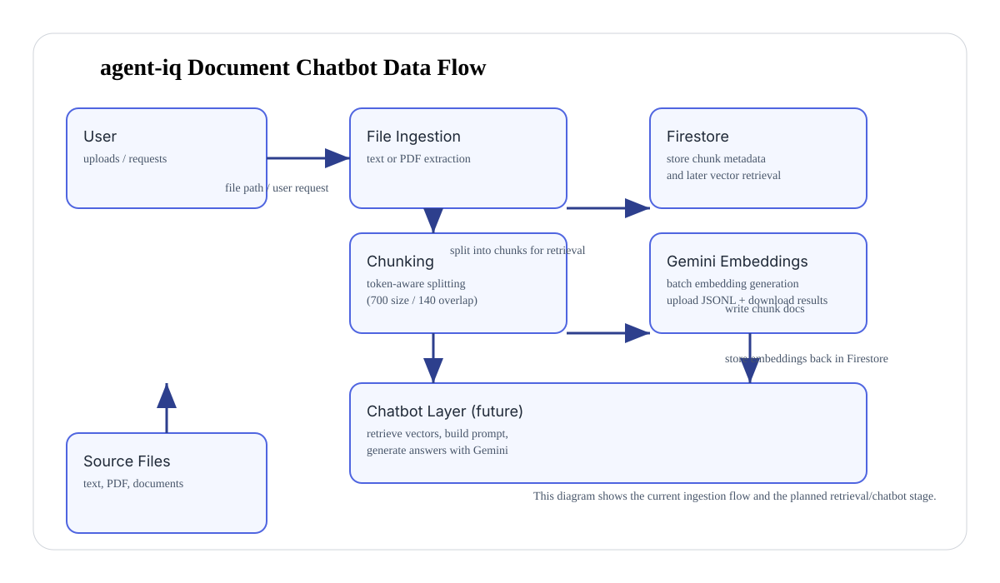

# agent-iq

`agent-iq` is a document chatbot foundation. It ingests text and PDF documents, converts them into searchable chunks, stores the chunks in Firebase Firestore, and uses Google Gemini embeddings to prepare the content for retrieval-driven conversations.

## What it does today

- reads plain text and PDF files
- splits documents into token-aware chunks
- persists chunk metadata into Firestore for later retrieval
- generates Gemini batch embeddings from chunk content
- updates Firestore documents with vector embeddings and token metadata

## Why this architecture

This project is intentionally built as a retrieval pipeline because a strong document chatbot depends on:

- reliable text extraction from multiple file formats
- chunking that preserves context for answer generation
- vector storage for semantic similarity search
- embeddings from a modern model like Gemini for retrieval quality

Each design choice is meant to keep the pipeline simple, extensible, and ready for a true chatbot layer.

## Key design decisions

### Why `firebase-admin`

`firebase-admin` is used for Firestore access because Firestore is already available in this project and it provides a managed vector-capable document store. Firestore allows chunk metadata and embeddings to live together, which is useful for future retrieval and prompt construction.

### Why `google-genai`

`google-genai` is used to connect to Gemini, which provides both embedding creation and later conversational capabilities. Using the same GenAI client library keeps the integration consistent and makes it easy to evolve this pipeline into a chatbot that can also call Gemini for response generation.

### Why `langchain-text-splitters`

`langchain-text-splitters` is used to split documents into chunks with a token-aware length function. This library is stable, widely adopted, and designed to work well with modern LLM embeddings and retrieval systems.

### Why token-aware chunking

The splitter uses a custom `estimate_gemini_tokens` function to measure text length in units that are closer to Gemini tokenization. This helps avoid huge chunks that exceed model limits and avoids too many tiny fragments that lose context.

### Why 700 token chunk size and 140 token overlap

- `EMBEDDING_CHUNK_SIZE=700` balances context and vector quality. It is large enough to preserve meaningful document passages while staying within typical embedding model limits.
- `EMBEDDING_OVERLAP_SIZE=140` ensures adjacent chunks share context. Overlap is important in document chatbots because it reduces the chance that a relevant answer is split across two chunks and improves retrieval recall.

These values are configurable through environment variables so the pipeline can be tuned later.

## Requirements

- Python 3.11+
- Firebase service account JSON key
- Google Gemini API key

## Install

```bash
python -m pip install .
```

For development dependencies:

```bash
python -m pip install .[dev]
```

## Environment

Create a `.env` file at the repository root with the following variables:

```env
GEMINI_API_KEY=your_genai_api_key
EMBEDDING_MODEL=gemini-embedding-2
EMBEDDING_CHUNK_SIZE=700
EMBEDDING_OVERLAP_SIZE=140
JSON_REQUESTS_FILE_NAME=chunks.jsonl
```

Place your Firebase service account key at the repository root as:

```text
agent_iq_firebase_admin_private_key.json
```

## Usage

Run the ingestion and embedding pipeline from `agent_iq/embeddings/ingest.py`:

```bash
python -m agent_iq.embeddings.ingest
```

The script will prompt for a file path and then:

1. read text or extract text from a PDF
2. split the content into overlapping chunks
3. write chunk metadata to Firestore
4. generate a JSONL upload file for Gemini batch embeddings
5. create a Gemini batch embedding job
6. download embeddings and attach them to Firestore documents

## Future chatbot evolution

This repo is structured so the next steps are natural:

- add a retrieval layer that queries Firestore by vector similarity
- add a prompt construction layer that combines matching chunks into a user query context
- call Gemini for answer generation using the retrieved context
- add conversation state and follow-up question handling

## Architecture diagram



## Project structure

- `main.py` — starter entry point
- `agent_iq/connections/firebase.py` — Firebase app initialization
- `agent_iq/connections/genai.py` — Gemini client initialization
- `agent_iq/embeddings/splitter.py` — chunking rules and token estimation
- `agent_iq/embeddings/chunking.py` — file reading and chunk preparation
- `agent_iq/embeddings/embed.py` — Firestore persistence and Gemini batch embedding flow

## Notes

- Firestore collection names are derived from the source file name.
- Embeddings are stored using `google.cloud.firestore_v1.vector.Vector`.
- The current implementation focuses on ingestion and vector preparation; retrieval and response generation are the next phase.

## License

This project is provided as-is.
